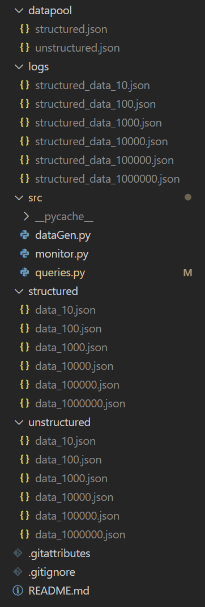
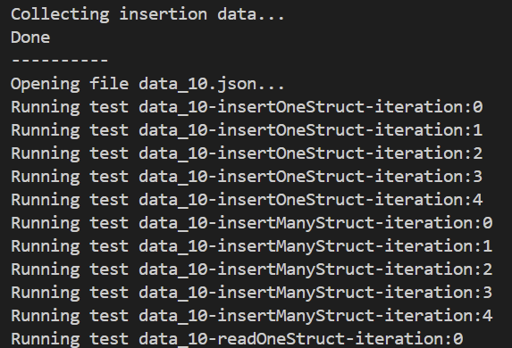
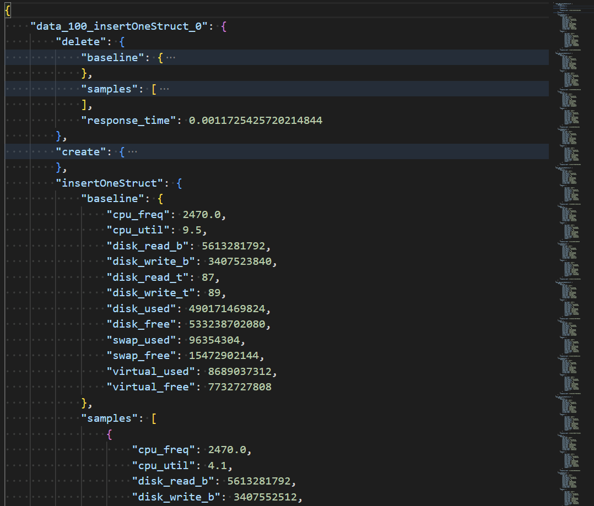

# MongoPerformance
 A repository to test the performance of a MongoDB database

# How to run:
1. download the requirements
    ```
    pip install -r requirements.txt
    ```
2. first generate the data
    ```
    python src/dataGen.py
    ```
    - directory should look like this as a result (logs will be missing)
    
    
    
    - NOTE: ensure you are running from the root directory as relative paths may not work.
3. run test
    - setup is done, now simply run
    ```
    python src/queries.py
    ```
    - this should generate the logs with the performance samples
    
    